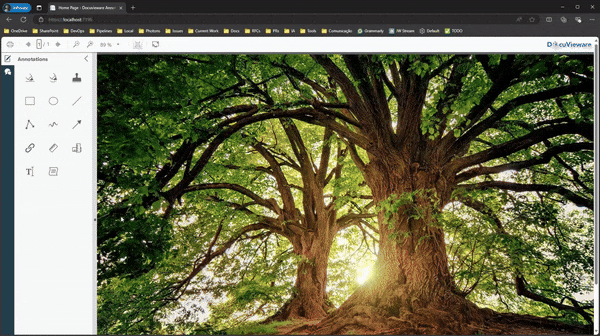

# DocuVieware annotation repro problem

## Error Description

The following server exception occurs:

GdPicture.Internal.WEB.DocuViewareCore.Requests.NewAnnotRequestCtx server exception: A ByRef-like type cannot be used as the type for an instance field in a non-ByRef-like type.

## Steps to Run

1. Copy the .env.template file to .env.
2. Set your license key in the .env file.

## Steps to Reproduce

1. Navigate to the Annotations menu.
2. Select Text.
3. Click Add.
4. Create a selection.

